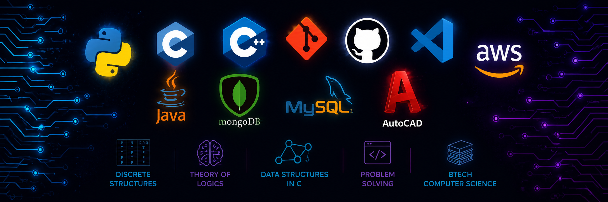

  

<h1 align="center">
  
</h1>

  <b>B.Tech CSE @ KIET | Building Scalable Solutions</b>
   
  Passionate about solving real-world problems with code & AI

  
  
  
  

---

## 🎯 About Me

- 🚀 Passionate **Full-Stack Developer** building scalable web applications  
- 🤖 Deep interest in **AI/ML** and creating intelligent solutions  
- ☁️ **AWS Certified** Cloud Practitioner with hands-on experience  
- 💡 Love solving complex problems with clean, efficient code  
- 📚 **Continuous Learner** - Always exploring new technologies  
- 🎯 Aspiring to work on **impactful projects** that make a difference  

 

---

## 🛠️ Tech Stack & Skills

### **Languages & Core**

  

### **Databases & Backend**

  

### **Frameworks & Tools**

  

### **DevOps & Cloud**

  

### **AI/ML & Specialized**

  

---

## 📊 GitHub Analytics

  
  

 

  

---

## 🚀 Featured Projects

| Project | Description | Tech Stack |
|---------|-------------|-----------|
| **[Deepfake Images Detector](https://github.com/ayushs1901/deepfake-images-detector)** | AI-powered detection system for deepfake images using deep learning | Python, TensorFlow, OpenCV |
| **[Unistay](https://github.com/ayushs1901/Unistay)** | Full-stack accommodation platform for students | MERN, MongoDB, AWS |
| **[Gym Management](https://github.com/ayushs1901/Gym-Management)** | Comprehensive gym management system with attendance tracking | Java, Spring Boot, MySQL |

  

---

## 🏆 Certifications & Achievements

  
  
  
  

---

## 💼 What I'm Currently Doing

- 🔨 Building scalable web applications with **MERN stack**  
- 🤖 Exploring **Advanced NLP & Computer Vision** techniques  
- 📚 Learning **System Design** and **Microservices Architecture**  
- 🌐 Contributing to **open-source projects**  
- 🎯 Preparing for **top-tier internships**  

---

## 📬 Let's Connect!

  <b>I'm always open to exciting opportunities and collaborations!</b>
    
  
  
  

---

  <i>⭐ If you find my work interesting, don't forget to give it a star!</i>
    
  

